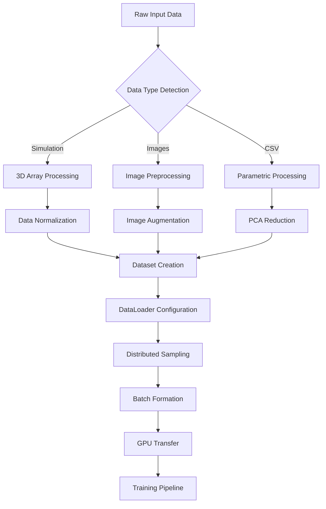

# SimulGenVAE Technical Documentation

**Comprehensive Technical Analysis of the SimulGenVAE v2.0.0 Codebase**

This document provides an in-depth technical analysis of every component, module, and system within the SimulGenVAE project. It serves as a complete reference for developers, researchers, and users who need to understand the internal workings of the system.

---

## Table of Contents

1. [System Architecture Overview](#system-architecture-overview)
2. [Core Components Analysis](#core-components-analysis)
3. [Module-by-Module Technical Analysis](#module-by-module-technical-analysis)
4. [Data Flow and Processing Pipeline](#data-flow-and-processing-pipeline)
5. [Configuration System Deep Dive](#configuration-system-deep-dive)
6. [Training Pipeline Architecture](#training-pipeline-architecture)
7. [Latent Conditioning Architectures](#latent-conditioning-architectures)
8. [Loss Functions and Optimization](#loss-functions-and-optimization)
9. [Distributed Training Implementation](#distributed-training-implementation)
10. [Memory Management and Performance](#memory-management-and-performance)
11. [Data Augmentation and Preprocessing](#data-augmentation-and-preprocessing)
12. [Visualization and Monitoring Systems](#visualization-and-monitoring-systems)
13. [API Reference](#api-reference)
14. [Implementation Details and Design Decisions](#implementation-details-and-design-decisions)

---

## System Architecture Overview

### High-Level Architecture

SimulGenVAE implements a **hierarchical variational autoencoder** with **multiple conditioning pathways** designed specifically for physics simulation data. The system architecture follows a modular design pattern with clear separation of concerns:

```
┌─────────────────────────────────────────────────────────────┐
│                    SimulGenVAE System                      │
├─────────────────────────────────────────────────────────────┤
│ Entry Points                                                │
│ ├── SimulGen-VAE.py (Main Training Orchestrator)           │
│ └── launch_ddp.py (Distributed Training Launcher)          │
├─────────────────────────────────────────────────────────────┤
│ Core VAE Components                                         │
│ ├── VAE_network.py (Hierarchical VAE Implementation)       │
│ ├── encoder.py (Progressive Encoding Networks)             │
│ └── decoder.py (Progressive Decoding Networks)             │
├─────────────────────────────────────────────────────────────┤
│ Latent Conditioning Subsystem                              │
│ ├── latent_conditioner_model_parametric.py (MLP-based)     │
│ ├── latent_conditioner_model_cnn.py (CNN/ViT-based)        │
│ ├── latent_conditioner.py (Training Orchestrator)          │
│ └── latent_conditioner_e2e.py (End-to-End Training)        │
├─────────────────────────────────────────────────────────────┤
│ Training and Optimization                                   │
│ ├── train.py (VAE Training Loops)                          │
│ ├── enhanced_latent_conditioner_training.py (Advanced LC)  │
│ ├── losses.py (Loss Function Implementations)              │
│ └── enhanced_loss_functions.py (Advanced Loss Functions)   │
├─────────────────────────────────────────────────────────────┤
│ Data Processing Pipeline                                    │
│ ├── data_preprocess.py (Dataset Processing)                │
│ ├── augmentation.py (Data Augmentation Systems)            │
│ ├── pca_preprocessor.py (Dimensionality Reduction)         │
│ └── utils.py (Core Data Loading and Utilities)             │
├─────────────────────────────────────────────────────────────┤
│ Support Systems                                             │
│ ├── common.py (Shared Utilities and Initialization)        │
│ ├── input_variables.py (Configuration Management)          │
│ ├── plotter.py (Visualization and Monitoring)              │
│ └── reconstruction_evaluator.py (Model Evaluation)         │
└─────────────────────────────────────────────────────────────┘
```

### Key Design Principles

1. **Modularity**: Each component has a well-defined responsibility and interface
2. **Scalability**: Supports both single-GPU and multi-GPU distributed training
3. **Flexibility**: Multiple conditioning architectures for different data types
4. **Performance**: Memory-efficient implementations with lazy loading options
5. **Robustness**: Comprehensive error handling and validation throughout

---

## Core Components Analysis

### 1. Main Entry Point: `SimulGen-VAE.py`

The main script serves as the central orchestrator for the entire training pipeline. It implements a comprehensive command-line interface and coordinates all subsystems.

#### Key Responsibilities:
- **Argument Parsing**: Handles command-line arguments with validation
- **Configuration Loading**: Reads and validates configuration from multiple sources
- **Distributed Training Setup**: Initializes DDP (DistributedDataParallel) when required
- **Training Mode Selection**: Routes between VAE training and Latent Conditioner training
- **Resource Management**: Manages GPU allocation and memory usage

#### Core Architecture:
```python
def main():
    """Main training orchestrator with the following pipeline:
    
    1. Parse command-line arguments and validate inputs
    2. Load configuration from preset.txt and condition.txt
    3. Initialize distributed training environment (if --use_ddp)
    4. Load and preprocess datasets based on configuration
    5. Route to appropriate training mode:
       - Full VAE training (lc_only=0)
       - Latent Conditioner only (lc_only=1)
       - End-to-end training (use_e2e_training=1)
    6. Initialize monitoring and logging systems
    7. Execute training pipeline with checkpointing
    8. Save final models and generate evaluation reports
    """
```

### 2. Distributed Training Launcher: `launch_ddp.py`

A convenience script that simplifies the launch of distributed training across multiple GPUs.

#### Features:
- **Automatic GPU Detection**: Discovers available GPUs and configures accordingly
- **Port Management**: Handles DDP communication port allocation
- **Parameter Forwarding**: Passes through all relevant training parameters
- **Process Management**: Manages torchrun subprocess execution

---

## Module-by-Module Technical Analysis

### `modules/VAE_network.py` - Core VAE Implementation

This module implements the central Variational Autoencoder with hierarchical latent spaces.

#### Architecture Details:

```python
class VAE(nn.Module):
    """Hierarchical Variational Autoencoder Implementation
    
    Architecture:
    - Hierarchical latent space: Main (32D) + Hierarchical (8D × layers)
    - Progressive encoder-decoder architecture
    - Multiple loss function support (MSE, MAE, SmoothL1, Huber)
    - Spectral normalization for training stability
    - Advanced memory management and gradient checkpointing
    """
    
    def __init__(self, args):
        super(VAE, self).__init__()
        
        # Core architecture components
        self.encoder = Encoder(args)         # Progressive encoding network
        self.decoder = Decoder(args)         # Progressive decoding network
        
        # Latent space dimensions
        self.latent_dim_main = args.Latent_dim_end      # 32D main space
        self.latent_dim_hierarchical = args.Latent_dim  # 8D hierarchical space
        
        # Loss function configuration
        self.loss_type = args.Loss_type      # 1:MSE, 2:MAE, 3:SmoothL1, 4:Huber
        
        # Training optimizations
        self.mixed_precision = args.use_mixed_precision if hasattr(args, 'use_mixed_precision') else False
```

#### Key Methods:

1. **`forward(self, x)`**: Main forward pass implementing the VAE inference
   ```python
   def forward(self, x):
       # Encoding phase
       encoded_features, mu_h, logvar_h = self.encoder(x)
       
       # Hierarchical latent sampling
       z_h = reparameterize(mu_h, logvar_h)
       
       # Main latent space processing
       mu_main, logvar_main = self.encode_to_main_latent(encoded_features)
       z_main = reparameterize(mu_main, logvar_main)
       
       # Decoding phase
       reconstructed = self.decoder(z_main, z_h)
       
       return reconstructed, mu_main, logvar_main, mu_h, logvar_h
   ```

2. **`compute_loss(self, x, reconstructed, mu_main, logvar_main, mu_h, logvar_h)`**: Comprehensive loss computation
   ```python
   def compute_loss(self, x, reconstructed, mu_main, logvar_main, mu_h, logvar_h):
       # Reconstruction loss based on self.loss_type
       if self.loss_type == 1:
           recon_loss = F.mse_loss(reconstructed, x, reduction='mean')
       elif self.loss_type == 2:
           recon_loss = F.l1_loss(reconstructed, x, reduction='mean')
       elif self.loss_type == 3:
           recon_loss = F.smooth_l1_loss(reconstructed, x, reduction='mean')
       elif self.loss_type == 4:
           recon_loss = F.huber_loss(reconstructed, x, reduction='mean')
       
       # KL divergence for both latent spaces
       kl_main = -0.5 * torch.sum(1 + logvar_main - mu_main.pow(2) - logvar_main.exp())
       kl_hierarchical = -0.5 * torch.sum(1 + logvar_h - mu_h.pow(2) - logvar_h.exp())
       
       return recon_loss, kl_main, kl_hierarchical
   ```

### `modules/encoder.py` - Progressive Encoder Networks

Implements hierarchical encoding with progressive feature extraction.

#### Architecture Features:
- **Multi-scale Feature Extraction**: Captures features at multiple resolutions
- **Spectral Normalization**: Applied to convolutional layers for training stability
- **Progressive Dimensionality Reduction**: Efficient parameter reduction through the network
- **Hierarchical Latent Generation**: Produces both main and hierarchical latent representations

#### Implementation Details:
```python
class Encoder(nn.Module):
    """Progressive Encoder with Hierarchical Feature Extraction
    
    Network Architecture:
    Input → Conv Blocks → Hierarchical Latent → Main Latent
    
    Features:
    - Progressive filter size reduction (1024→512→256→128)
    - Spectral normalization on all convolutional layers
    - Hierarchical feature extraction at intermediate layers
    - Memory-efficient implementation with gradient checkpointing
    """
    
    def __init__(self, args):
        super(Encoder, self).__init__()
        
        # Extract filter configuration from preset
        filters = args.num_filter_enc  # e.g., [1024, 512, 256, 128]
        
        # Build progressive convolutional layers
        self.conv_layers = nn.ModuleList()
        prev_channels = args.input_channels
        
        for i, out_channels in enumerate(filters):
            layer = nn.Sequential(
                add_sn(nn.Conv2d(prev_channels, out_channels, 
                                kernel_size=4, stride=2, padding=1)),
                nn.BatchNorm2d(out_channels),
                nn.LeakyReLU(0.2, inplace=True),
                nn.Dropout2d(0.1)  # Regularization
            )
            self.conv_layers.append(layer)
            prev_channels = out_channels
        
        # Hierarchical latent space projection
        self.hierarchical_projection = nn.Linear(
            self._get_feature_size(), args.Latent_dim * 2  # mu + logvar
        )
        
        # Main latent space projection  
        self.main_projection = nn.Linear(
            args.Latent_dim, args.Latent_dim_end * 2  # mu + logvar
        )
```

### `modules/decoder.py` - Progressive Decoder Networks

Implements hierarchical decoding with progressive upsampling and reconstruction.

#### Architecture Features:
- **Progressive Upsampling**: Reverses the encoding process with learned upsampling
- **Multi-scale Reconstruction**: Combines features from multiple scales
- **Hierarchical Conditioning**: Integrates both main and hierarchical latent codes
- **Advanced Activation Functions**: Uses modern activation functions (SiLU, GELU)

#### Key Implementation:
```python
class Decoder(nn.Module):
    """Progressive Decoder with Hierarchical Reconstruction
    
    Architecture:
    Latent Code → Linear Projection → Progressive Upsampling → Output
    
    Features:
    - Combines main and hierarchical latent representations
    - Progressive filter size increase (128→256→512→1024)
    - Learned upsampling with transposed convolutions
    - Skip connections for feature preservation
    """
    
    def forward(self, z_main, z_hierarchical):
        # Combine latent representations
        combined_latent = torch.cat([z_main, z_hierarchical], dim=1)
        
        # Initial projection to feature space
        features = self.initial_projection(combined_latent)
        features = features.view(features.size(0), -1, self.initial_size, self.initial_size)
        
        # Progressive upsampling through deconvolutional layers
        for i, deconv_layer in enumerate(self.deconv_layers):
            features = deconv_layer(features)
            
            # Apply attention mechanisms at specific scales
            if i in self.attention_layers:
                features = self.apply_attention(features)
        
        # Final output projection
        output = self.output_projection(features)
        
        return output
```

### `modules/train.py` - VAE Training Implementation

Contains the main training loops and optimization logic for the VAE.

#### Key Components:

1. **WarmupKLLoss Class**: Implements KL divergence warmup scheduling
   ```python
   class WarmupKLLoss:
       """KL Divergence Warmup Scheduler
       
       Implements gradual introduction of KL divergence term to prevent
       posterior collapse in VAE training.
       
       Parameters:
       - init_beta: Initial beta value for KL term
       - start_warmup: Epoch to begin warmup
       - end_warmup: Epoch to complete warmup  
       - beta_target: Final beta value
       """
       
       def get_loss(self, step, losses):
           # Calculate current beta based on training step
           if step < self.start_warmup:
               beta = self.init_beta
           elif step > self.end_warmup:
               beta = self.beta_target
           else:
               # Linear warmup
               warmup_progress = (step - self.start_warmup) / (self.end_warmup - self.start_warmup)
               beta = self.init_beta + warmup_progress * (self.beta_target - self.init_beta)
           
           # Combine reconstruction and KL losses
           total_loss = losses['reconstruction'] + beta * losses['kl_divergence']
           return total_loss, beta
   ```

2. **Training Loop Implementation**:
   ```python
   def train_vae(model, dataloader, optimizer, criterion, device, args):
       """Main VAE training loop with comprehensive monitoring
       
       Features:
       - Mixed precision training support
       - Gradient accumulation for large batch sizes
       - Real-time loss monitoring and logging
       - Checkpoint saving with best model tracking
       - Memory usage monitoring and optimization
       """
       
       model.train()
       total_loss = 0
       total_recon_loss = 0
       total_kl_loss = 0
       
       for batch_idx, (data, _) in enumerate(dataloader):
           data = data.to(device)
           
           optimizer.zero_grad()
           
           # Forward pass through VAE
           reconstructed, mu_main, logvar_main, mu_h, logvar_h = model(data)
           
           # Compute comprehensive loss
           recon_loss, kl_main, kl_h = model.compute_loss(
               data, reconstructed, mu_main, logvar_main, mu_h, logvar_h
           )
           
           # Apply KL warmup scheduling
           total_kl = kl_main + kl_h
           final_loss, current_beta = warmup_scheduler.get_loss(
               epoch, {'reconstruction': recon_loss, 'kl_divergence': total_kl}
           )
           
           # Backward pass with gradient scaling (mixed precision)
           if args.use_mixed_precision:
               scaler.scale(final_loss).backward()
               scaler.step(optimizer)
               scaler.update()
           else:
               final_loss.backward()
               optimizer.step()
           
           # Update metrics
           total_loss += final_loss.item()
           total_recon_loss += recon_loss.item()
           total_kl_loss += total_kl.item()
   ```

### `modules/latent_conditioner_model_parametric.py` - MLP-Based Conditioning

Implements Multi-Layer Perceptron architecture for parametric/tabular data conditioning.

#### Advanced Features:
- **Residual Connections**: Improves gradient flow in deep networks
- **Layer Normalization**: Provides batch-independent normalization
- **Progressive Dropout**: Increases regularization through the network
- **Adaptive Architecture**: Automatically sizes bottleneck based on input complexity

#### Architecture Implementation:
```python
class ParametricLatentConditioner(nn.Module):
    """Advanced MLP for Parametric Data Conditioning
    
    Architecture:
    Input → Feature Extraction → Residual Blocks → Dual Output Heads
    
    Features:
    - Residual connections with gating mechanisms
    - Progressive dropout (0.1 → 0.2 → 0.3)
    - Layer normalization for training stability
    - GELU activations for improved gradient flow
    - Dual output heads for main and hierarchical latent prediction
    """
    
    def __init__(self, input_dim, latent_dim_main, latent_dim_hierarchical, hidden_dims):
        super(ParametricLatentConditioner, self).__init__()
        
        # Adaptive bottleneck sizing
        bottleneck_dim = max(64, min(512, input_dim // 4))
        
        # Feature extraction backbone
        self.feature_extractor = nn.Sequential(
            nn.Linear(input_dim, hidden_dims[0]),
            nn.LayerNorm(hidden_dims[0]),
            nn.GELU(),
            nn.Dropout(0.1)
        )
        
        # Residual processing blocks
        self.residual_blocks = nn.ModuleList()
        for i in range(len(hidden_dims) - 1):
            block = ResidualBlock(
                hidden_dims[i], 
                hidden_dims[i + 1],
                dropout_rate=0.1 + i * 0.05  # Progressive dropout
            )
            self.residual_blocks.append(block)
        
        # Dual output heads
        final_dim = hidden_dims[-1]
        self.main_head = nn.Sequential(
            nn.Linear(final_dim, bottleneck_dim),
            nn.LayerNorm(bottleneck_dim),
            nn.GELU(),
            nn.Dropout(0.2),
            nn.Linear(bottleneck_dim, latent_dim_main)
        )
        
        self.hierarchical_head = nn.Sequential(
            nn.Linear(final_dim, bottleneck_dim),
            nn.LayerNorm(bottleneck_dim),  
            nn.GELU(),
            nn.Dropout(0.2),
            nn.Linear(bottleneck_dim, latent_dim_hierarchical)
        )

class ResidualBlock(nn.Module):
    """Enhanced Residual Block with Gating Mechanism"""
    
    def __init__(self, input_dim, output_dim, dropout_rate=0.1):
        super(ResidualBlock, self).__init__()
        
        # Main path
        self.main_path = nn.Sequential(
            nn.Linear(input_dim, output_dim),
            nn.LayerNorm(output_dim),
            nn.GELU(),
            nn.Dropout(dropout_rate),
            nn.Linear(output_dim, output_dim),
            nn.LayerNorm(output_dim)
        )
        
        # Residual connection with optional projection
        if input_dim != output_dim:
            self.residual_projection = nn.Linear(input_dim, output_dim)
        else:
            self.residual_projection = nn.Identity()
        
        # Gating mechanism for adaptive feature selection
        self.gate = nn.Sequential(
            nn.Linear(output_dim, output_dim),
            nn.Sigmoid()
        )
    
    def forward(self, x):
        # Main processing path
        main_output = self.main_path(x)
        
        # Residual connection
        residual = self.residual_projection(x)
        
        # Gated combination
        gate_weights = self.gate(main_output)
        output = gate_weights * main_output + (1 - gate_weights) * residual
        
        return F.gelu(output)
```

### `modules/latent_conditioner_model_cnn.py` - CNN/Vision Transformer Conditioning

Implements state-of-the-art CNN architecture for image-to-latent regression.

#### Advanced Features:
- **ResNet-style Backbone**: Modern residual architecture with GroupNorm
- **Squeeze-and-Excitation Attention**: Channel-wise attention mechanisms
- **Spectral Normalization**: Training stability for GAN-like objectives
- **Adaptive Pooling**: Handles variable input sizes gracefully

#### Implementation Details:
```python
class CNNLatentConditioner(nn.Module):
    """State-of-the-Art CNN for Image Conditioning
    
    Architecture:
    Image → ResNet Backbone → SE Attention → Global Pooling → Dual Heads
    
    Features:
    - ResNet blocks with GroupNorm and SE attention
    - Progressive channel scaling (64→128→256→512)
    - Spectral normalization for all convolutional layers
    - SiLU activation functions for improved gradient flow
    - Spatial attention mechanisms (optional)
    - Dual output heads for latent prediction
    """
    
    def __init__(self, input_channels=3, latent_dim_main=32, latent_dim_hierarchical=8):
        super(CNNLatentConditioner, self).__init__()
        
        # Progressive feature extraction backbone
        self.backbone = nn.Sequential(
            # Initial feature extraction
            spectral_norm(nn.Conv2d(input_channels, 64, 7, stride=2, padding=3)),
            nn.GroupNorm(8, 64),
            nn.SiLU(inplace=True),
            nn.MaxPool2d(3, stride=2, padding=1),
            
            # ResNet blocks with SE attention
            self._make_resnet_stage(64, 128, num_blocks=2, stride=2),
            self._make_resnet_stage(128, 256, num_blocks=2, stride=2),  
            self._make_resnet_stage(256, 512, num_blocks=2, stride=2),
            
            # Global feature aggregation
            nn.AdaptiveAvgPool2d((1, 1))
        )
        
        # Optional spatial attention
        self.spatial_attention = SpatialAttentionModule(512) if use_spatial_attention else None
        
        # Dual output heads with shared feature processing
        shared_dim = 256
        self.shared_processor = nn.Sequential(
            nn.Linear(512, shared_dim),
            nn.GroupNorm(1, shared_dim),
            nn.SiLU(),
            nn.Dropout(0.3)
        )
        
        # Main latent head
        self.main_head = nn.Sequential(
            nn.Linear(shared_dim, 128),
            nn.GroupNorm(1, 128),
            nn.SiLU(),
            nn.Dropout(0.2),
            nn.Linear(128, latent_dim_main)
        )
        
        # Hierarchical latent head
        self.hierarchical_head = nn.Sequential(
            nn.Linear(shared_dim, 64),
            nn.GroupNorm(1, 64),
            nn.SiLU(),
            nn.Dropout(0.2),
            nn.Linear(64, latent_dim_hierarchical)
        )
    
    def _make_resnet_stage(self, in_channels, out_channels, num_blocks, stride):
        """Create a ResNet stage with SE attention"""
        layers = []
        
        # First block with potential downsampling
        layers.append(
            ResNetBlockWithSE(in_channels, out_channels, stride=stride)
        )
        
        # Subsequent blocks
        for _ in range(num_blocks - 1):
            layers.append(
                ResNetBlockWithSE(out_channels, out_channels, stride=1)
            )
        
        return nn.Sequential(*layers)

class ResNetBlockWithSE(nn.Module):
    """ResNet Block with Squeeze-and-Excitation Attention"""
    
    def __init__(self, in_channels, out_channels, stride=1):
        super(ResNetBlockWithSE, self).__init__()
        
        # Main convolutional path
        self.conv1 = spectral_norm(nn.Conv2d(in_channels, out_channels, 3, stride, 1))
        self.norm1 = nn.GroupNorm(8, out_channels)
        
        self.conv2 = spectral_norm(nn.Conv2d(out_channels, out_channels, 3, 1, 1))
        self.norm2 = nn.GroupNorm(8, out_channels)
        
        # SE attention module
        self.se_attention = SEAttention(out_channels)
        
        # Residual connection
        if in_channels != out_channels or stride != 1:
            self.residual_projection = nn.Sequential(
                spectral_norm(nn.Conv2d(in_channels, out_channels, 1, stride)),
                nn.GroupNorm(8, out_channels)
            )
        else:
            self.residual_projection = nn.Identity()
    
    def forward(self, x):
        # Main path
        out = F.silu(self.norm1(self.conv1(x)))
        out = self.norm2(self.conv2(out))
        
        # SE attention
        out = self.se_attention(out)
        
        # Residual connection
        residual = self.residual_projection(x)
        
        return F.silu(out + residual)

class SEAttention(nn.Module):
    """Squeeze-and-Excitation Attention Module"""
    
    def __init__(self, channels, reduction=16):
        super(SEAttention, self).__init__()
        
        reduced_dim = max(1, channels // reduction)
        
        self.attention = nn.Sequential(
            nn.AdaptiveAvgPool2d(1),
            nn.Flatten(),
            nn.Linear(channels, reduced_dim),
            nn.SiLU(),
            nn.Linear(reduced_dim, channels),
            nn.Sigmoid()
        )
    
    def forward(self, x):
        # Compute attention weights
        attention_weights = self.attention(x)
        attention_weights = attention_weights.view(x.size(0), x.size(1), 1, 1)
        
        # Apply attention
        return x * attention_weights
```

---

## Data Flow and Processing Pipeline

### Input Data Processing Architecture



### Data Processing Modules

#### `modules/data_preprocess.py` - Dataset Processing

```python
class SimulationDataProcessor:
    """Comprehensive Simulation Data Processing Pipeline
    
    Handles:
    - Data normalization and scaling
    - Temporal sequence processing
    - Spatial node handling
    - Memory-efficient chunking for large datasets
    - Multi-scale feature extraction preparation
    """
    
    def __init__(self, config):
        self.dim1 = config.Dim1  # Parameters (484)
        self.dim2 = config.Dim2  # Timesteps (200) 
        self.dim3 = config.Dim3  # Nodes (95008)
        
        # Reduction parameters for memory management
        self.dim2_reduced = config.Dim2_red if hasattr(config, 'Dim2_red') else self.dim2
        self.dim3_start = config.Dim3_start if hasattr(config, 'Dim3_start') else 0
        self.dim3_end = config.Dim3_end if hasattr(config, 'Dim3_end') else self.dim3
    
    def process_dataset(self, raw_data):
        """Process raw simulation data with comprehensive preprocessing
        
        Steps:
        1. Validate input dimensions and data integrity
        2. Apply temporal reduction if specified
        3. Apply spatial node selection if specified  
        4. Normalize data using robust scaling
        5. Handle missing values and outliers
        6. Create memory-mapped arrays for large datasets
        """
        
        # Input validation
        assert raw_data.shape == (self.dim1, self.dim2, self.dim3), \
            f"Expected shape {(self.dim1, self.dim2, self.dim3)}, got {raw_data.shape}"
        
        # Temporal reduction
        if self.dim2_reduced < self.dim2:
            # Intelligent temporal downsampling preserving key dynamics
            indices = self._compute_temporal_sampling_indices()
            processed_data = raw_data[:, indices, :]
        else:
            processed_data = raw_data
        
        # Spatial node selection
        if self.dim3_start > 0 or self.dim3_end < self.dim3:
            processed_data = processed_data[:, :, self.dim3_start:self.dim3_end]
        
        # Robust normalization
        normalized_data = self._apply_robust_normalization(processed_data)
        
        # Memory optimization
        if self._should_use_memory_mapping(normalized_data):
            return self._create_memory_mapped_dataset(normalized_data)
        
        return normalized_data
    
    def _apply_robust_normalization(self, data):
        """Apply robust normalization handling outliers"""
        
        # Compute robust statistics (median, MAD)
        median = np.median(data, axis=(0, 1), keepdims=True)
        mad = np.median(np.abs(data - median), axis=(0, 1), keepdims=True)
        
        # Avoid division by zero
        mad = np.where(mad == 0, 1.0, mad)
        
        # Robust scaling
        normalized = (data - median) / (1.4826 * mad)  # 1.4826 converts MAD to std equiv
        
        # Clip extreme outliers
        normalized = np.clip(normalized, -5.0, 5.0)
        
        return normalized.astype(np.float32)
```

#### `modules/augmentation.py` - Data Augmentation Systems

```python
class ComprehensiveAugmentation:
    """Advanced Data Augmentation Pipeline
    
    Supports:
    - Temporal augmentations (time warping, noise injection)
    - Spatial augmentations (node permutation, masking)
    - Physics-aware augmentations (parameter perturbation)
    - Stochastic augmentations with probability scheduling
    """
    
    def __init__(self, config):
        self.config = config
        
        # Augmentation probability scheduling
        self.temporal_prob = 0.3
        self.spatial_prob = 0.2  
        self.noise_prob = 0.4
        self.parameter_prob = 0.1
        
        # Noise parameters
        self.noise_std_range = (0.01, 0.05)
        self.temporal_warp_range = (0.95, 1.05)
        
    def apply_augmentations(self, data, mode='train'):
        """Apply comprehensive augmentation pipeline"""
        
        if mode != 'train':
            return data
        
        augmented_data = data.copy()
        
        # Temporal augmentations
        if np.random.random() < self.temporal_prob:
            augmented_data = self._apply_temporal_warping(augmented_data)
        
        # Spatial augmentations  
        if np.random.random() < self.spatial_prob:
            augmented_data = self._apply_spatial_masking(augmented_data)
        
        # Noise injection
        if np.random.random() < self.noise_prob:
            augmented_data = self._inject_gaussian_noise(augmented_data)
        
        # Parameter perturbation (physics-aware)
        if np.random.random() < self.parameter_prob:
            augmented_data = self._perturb_parameters(augmented_data)
        
        return augmented_data
    
    def _apply_temporal_warping(self, data):
        """Apply subtle temporal warping preserving dynamics"""
        
        original_length = data.shape[1]
        warp_factor = np.random.uniform(*self.temporal_warp_range)
        new_length = int(original_length * warp_factor)
        
        # Create warping indices
        original_indices = np.linspace(0, original_length - 1, new_length)
        
        # Apply warping using interpolation
        warped_data = np.zeros((data.shape[0], new_length, data.shape[2]))
        
        for param_idx in range(data.shape[0]):
            for node_idx in range(data.shape[2]):
                warped_data[param_idx, :, node_idx] = np.interp(
                    original_indices,
                    np.arange(original_length),
                    data[param_idx, :, node_idx]
                )
        
        # Resize back to original length
        if new_length != original_length:
            final_indices = np.linspace(0, new_length - 1, original_length)
            final_data = np.zeros_like(data)
            
            for param_idx in range(data.shape[0]):
                for node_idx in range(data.shape[2]):
                    final_data[param_idx, :, node_idx] = np.interp(
                        final_indices,
                        np.arange(new_length), 
                        warped_data[param_idx, :, node_idx]
                    )
            
            return final_data
        
        return warped_data
```

---

## Configuration System Deep Dive

### Configuration Architecture

The SimulGenVAE system uses a **hierarchical configuration system** with multiple sources and validation layers:

```
Configuration Hierarchy:
1. Command Line Arguments (Highest Priority)
2. preset.txt (Architecture Configuration)  
3. input_data/condition.txt (Detailed Parameters)
4. Default Values (Fallback)
```

### `preset.txt` Configuration Format

```
Line 1: data_No, init_beta_divisor, num_filter_enc, latent_conditioner_filter
Line 2: <dataset_number>                    # 1-5, selects dataset configuration
Line 3: <beta_divisor>                      # KL warmup parameter (0 = no warmup)
Line 4: <encoder_filters>                   # Space-separated filter progression
Line 5: <conditioner_filters>               # Space-separated conditioner architecture
```

#### Example Configuration:
```
data_No, init_beta_divisior, num_filter_enc, latent_conditioner_filter
1                           # Dataset 1 selected
0                           # No KL warmup (immediate full KL loss)
1024 512 256 128           # VAE encoder: 1024→512→256→128 filters
8 16 32 64 128 256 128     # Conditioner: progressive expansion then contraction
```

### `input_data/condition.txt` Comprehensive Configuration

#### Data Configuration Section:
```ini
# Simulation Data Dimensions
Dim1        484      # Number of parameter sets in simulation
Dim2        200      # Number of temporal timesteps
Dim3        95008    # Number of spatial nodes/elements
num_var     1        # Number of physical variables

# Data Reduction Parameters (for memory management)
Dim2_red    200      # Reduced temporal dimension (≤ Dim2)
Dim3_start  0        # Starting spatial index
Dim3_end    95008    # Ending spatial index
```

#### VAE Training Configuration:
```ini
# Core Training Parameters
Training_epochs     10002    # Total training epochs
Batch_size         16       # Training batch size (adjust for GPU memory)
LearningR          0.001    # Base learning rate for VAE
Latent_dim         8        # Hierarchical latent space dimension
Latent_dim_end     32       # Main latent space dimension
Loss_type          1        # Reconstruction loss: 1=MSE, 2=MAE, 3=SmoothL1, 4=Huber
alpha              1000000  # KL divergence scaling factor
Stretch            0        # Temporal stretching factor (0=disabled)
Recon_iter         1        # Reconstruction iterations per training step
```

#### Latent Conditioner Configuration:
```ini
# Conditioning System Parameters
num_param                     1        # Number of conditioning parameters
param_dir                     /images  # Directory containing conditioning data
input_type                    image    # Input type: 'image' or 'csvs'
param_data_type              .png     # File extension for input data
n_epoch                      10000    # Conditioner training epochs
latent_conditioner_lr        0.001    # Conditioner learning rate
latent_conditioner_batch     16       # Conditioner batch size
latent_conditioner_weight_decay 1e-5  # Weight decay for regularization
latent_conditioner_dropout_rate 0.1   # Dropout rate for regularization
use_spatial_attention        1        # Enable spatial attention (1=on, 0=off)
```

#### End-to-End Training Configuration:
```ini
# Advanced Training Features  
use_e2e_training             1        # Enable end-to-end training (1=on, 0=off)
e2e_loss_function           Huber     # E2E loss: MSE, MAE, Huber, SmoothL1
e2e_vae_model_path          model_save/SimulGen-VAE  # Pre-trained VAE path
use_latent_regularization   1         # Enable latent space regularization
LC_alpha                    1000000   # Latent conditioner alpha scaling
latent_reg_weight           0.001     # Latent regularization weight
```

### Configuration Parsing and Validation

#### `modules/input_variables.py` Implementation:

```python
class ConfigurationManager:
    """Comprehensive Configuration Management System
    
    Handles:
    - Multi-source configuration loading and merging
    - Parameter validation and type conversion
    - Default value management
    - Configuration consistency checking
    - Dynamic parameter updates during training
    """
    
    def __init__(self):
        self.config = {}
        self.validators = self._initialize_validators()
        self.defaults = self._initialize_defaults()
    
    def load_configuration(self, preset_path='preset.txt', condition_path='input_data/condition.txt'):
        """Load and merge configuration from multiple sources"""
        
        # Load preset configuration
        preset_config = self._parse_preset_file(preset_path)
        
        # Load detailed condition configuration
        condition_config = self._parse_condition_file(condition_path)
        
        # Merge configurations with priority handling
        merged_config = self._merge_configurations(preset_config, condition_config)
        
        # Apply validation
        validated_config = self._validate_configuration(merged_config)
        
        # Convert to accessible object
        self.config = self._create_config_object(validated_config)
        
        return self.config
    
    def _parse_condition_file(self, filepath):
        """Parse condition.txt with comprehensive error handling"""
        
        config_dict = {}
        
        with open(filepath, 'r') as f:
            lines = f.readlines()
        
        for line_num, line in enumerate(lines, 1):
            line = line.strip()
            
            # Skip comments and empty lines
            if not line or line.startswith('#') or line.startswith('%') or line.startswith("'"):
                continue
            
            # Parse key-value pairs
            if '\t' in line:
                parts = line.split('\t')
                if len(parts) >= 2:
                    key = parts[0].strip()
                    value_str = parts[1].strip()
                    
                    # Remove inline comments
                    if '#' in value_str:
                        value_str = value_str.split('#')[0].strip()
                    
                    # Type conversion with validation
                    try:
                        config_dict[key] = self._convert_value_type(key, value_str)
                    except Exception as e:
                        raise ValueError(f"Configuration error at line {line_num}: {e}")
        
        return config_dict
    
    def _validate_configuration(self, config):
        """Comprehensive configuration validation"""
        
        errors = []
        
        # Dimensional consistency checks
        if 'Dim2_red' in config and config['Dim2_red'] > config['Dim2']:
            errors.append("Dim2_red cannot exceed Dim2")
        
        if 'Dim3_end' in config and config['Dim3_end'] > config['Dim3']:
            errors.append("Dim3_end cannot exceed Dim3") 
        
        if 'Dim3_start' in config and config['Dim3_start'] >= config['Dim3_end']:
            errors.append("Dim3_start must be less than Dim3_end")
        
        # Latent dimension validation
        if config['Latent_dim'] <= 0 or config['Latent_dim_end'] <= 0:
            errors.append("Latent dimensions must be positive")
        
        # Training parameter validation
        if config['LearningR'] <= 0 or config['LearningR'] > 1:
            errors.append("Learning rate must be in (0, 1]")
        
        if config['Batch_size'] <= 0:
            errors.append("Batch size must be positive")
        
        # Loss type validation
        if config['Loss_type'] not in [1, 2, 3, 4]:
            errors.append("Loss_type must be 1 (MSE), 2 (MAE), 3 (SmoothL1), or 4 (Huber)")
        
        # File path validation
        if config.get('input_type') == 'image':
            if not config.get('param_dir'):
                errors.append("param_dir must be specified for image input type")
        
        if errors:
            raise ValueError(f"Configuration validation failed:\n" + "\n".join(f"- {error}" for error in errors))
        
        return config
```

---

## Training Pipeline Architecture

### Training Mode Selection Logic

The training pipeline supports three distinct modes with different optimization strategies:

```python
def select_training_mode(config, args):
    """Intelligent training mode selection with validation
    
    Modes:
    1. Full VAE Training (lc_only=0): Complete pipeline training
    2. Latent Conditioner Only (lc_only=1): Frozen VAE with conditioner training  
    3. End-to-End Training (use_e2e_training=1): Joint optimization
    """
    
    if args.lc_only == "1":
        # Latent Conditioner Only Mode
        required_vae_path = config.e2e_vae_model_path if hasattr(config, 'e2e_vae_model_path') else None
        if not required_vae_path or not os.path.exists(required_vae_path):
            raise FileNotFoundError("Pre-trained VAE model required for LC-only training")
        
        return "latent_conditioner_only", required_vae_path
    
    elif hasattr(config, 'use_e2e_training') and config.use_e2e_training == 1:
        # End-to-End Training Mode
        vae_path = config.e2e_vae_model_path
        conditioner_path = config.get('e2e_conditioner_model_path')
        
        if not os.path.exists(vae_path):
            raise FileNotFoundError(f"Pre-trained VAE not found: {vae_path}")
        
        return "end_to_end", (vae_path, conditioner_path)
    
    else:
        # Full VAE Training Mode
        return "full_vae", None
```

### Advanced Training Features

#### Mixed Precision Training Implementation:

```python
class MixedPrecisionTrainer:
    """Advanced Mixed Precision Training with Gradient Scaling
    
    Features:
    - Automatic loss scaling with dynamic adjustment
    - Gradient overflow detection and handling
    - Memory usage optimization
    - Training speed acceleration (1.5-2x speedup)
    """
    
    def __init__(self, model, optimizer, initial_scale=65536.0):
        self.model = model
        self.optimizer = optimizer
        self.scaler = GradScaler(init_scale=initial_scale)
        self.scale_window = 2000  # Steps between scale updates
        
    def training_step(self, batch_data, criterion):
        """Execute one training step with mixed precision"""
        
        self.optimizer.zero_grad()
        
        # Forward pass with autocast
        with autocast():
            output = self.model(batch_data)
            loss = criterion(output, batch_data)
        
        # Backward pass with gradient scaling
        self.scaler.scale(loss).backward()
        
        # Gradient clipping before unscaling
        self.scaler.unscale_(self.optimizer)
        torch.nn.utils.clip_grad_norm_(self.model.parameters(), max_norm=1.0)
        
        # Optimizer step with scale update
        self.scaler.step(self.optimizer)
        self.scaler.update()
        
        return loss.item()
```

#### Gradient Checkpointing Implementation:

```python
class GradientCheckpointingVAE(VAE):
    """VAE with Gradient Checkpointing for Memory Efficiency
    
    Trades computation for memory by recomputing activations during backward pass.
    Enables training of larger models on limited GPU memory.
    """
    
    def __init__(self, *args, **kwargs):
        super(GradientCheckpointingVAE, self).__init__(*args, **kwargs)
        self.use_checkpointing = True
        
    def forward(self, x):
        if self.use_checkpointing and self.training:
            return self._forward_with_checkpointing(x)
        else:
            return super().forward(x)
    
    def _forward_with_checkpointing(self, x):
        """Forward pass with gradient checkpointing"""
        
        # Checkpoint encoder blocks
        encoded_features = checkpoint(self._encode_block_1, x)
        encoded_features = checkpoint(self._encode_block_2, encoded_features)
        encoded_features = checkpoint(self._encode_block_3, encoded_features)
        
        # Checkpoint latent processing
        mu_main, logvar_main, mu_h, logvar_h = checkpoint(
            self._latent_processing, encoded_features
        )
        
        # Checkpoint decoder blocks
        z_main = reparameterize(mu_main, logvar_main)
        z_h = reparameterize(mu_h, logvar_h)
        
        decoded = checkpoint(self._decode_block_1, z_main, z_h)
        decoded = checkpoint(self._decode_block_2, decoded)  
        output = checkpoint(self._decode_block_3, decoded)
        
        return output, mu_main, logvar_main, mu_h, logvar_h
```

---

## Loss Functions and Optimization

### Advanced Loss Function Implementation

#### `modules/losses.py` Core Loss Functions:

```python
def kl_divergence_hierarchical(mu_main, logvar_main, mu_h, logvar_h, beta_main=1.0, beta_h=1.0):
    """Hierarchical KL Divergence with Separate Beta Scheduling
    
    Computes KL divergence for both main and hierarchical latent spaces
    with independent beta scheduling for balanced optimization.
    
    Mathematical formulation:
    KL(q(z|x) || p(z)) = -0.5 * sum(1 + log(σ²) - μ² - σ²)
    
    Args:
        mu_main: Mean of main latent distribution [batch_size, latent_dim_main]
        logvar_main: Log variance of main latent distribution
        mu_h: Mean of hierarchical latent distribution [batch_size, latent_dim_h] 
        logvar_h: Log variance of hierarchical latent distribution
        beta_main: Beta scaling for main latent KL
        beta_h: Beta scaling for hierarchical latent KL
    
    Returns:
        tuple: (kl_main_scaled, kl_h_scaled, kl_total)
    """
    
    # Main latent space KL divergence
    kl_main = -0.5 * torch.sum(1 + logvar_main - mu_main.pow(2) - logvar_main.exp(), dim=1)
    kl_main_mean = torch.mean(kl_main)
    kl_main_scaled = beta_main * kl_main_mean
    
    # Hierarchical latent space KL divergence
    kl_h = -0.5 * torch.sum(1 + logvar_h - mu_h.pow(2) - logvar_h.exp(), dim=1)  
    kl_h_mean = torch.mean(kl_h)
    kl_h_scaled = beta_h * kl_h_mean
    
    # Combined KL loss
    kl_total = kl_main_scaled + kl_h_scaled
    
    return kl_main_scaled, kl_h_scaled, kl_total

def reconstruction_loss_adaptive(output, target, loss_type=1, reduction='mean'):
    """Adaptive Reconstruction Loss with Multiple Function Support
    
    Supports multiple loss functions optimized for different data characteristics:
    - MSE: Gaussian noise assumption, penalizes large errors heavily
    - MAE: Laplacian noise assumption, robust to outliers  
    - SmoothL1: Hybrid approach, MSE for small errors, MAE for large errors
    - Huber: Robust loss with tunable transition point
    
    Args:
        output: Model predictions [batch_size, ...]
        target: Ground truth values [batch_size, ...]
        loss_type: Loss function type (1=MSE, 2=MAE, 3=SmoothL1, 4=Huber)
        reduction: Reduction method ('mean', 'sum', 'none')
    
    Returns:
        torch.Tensor: Computed reconstruction loss
    """
    
    if loss_type == 1:  # Mean Squared Error
        loss = F.mse_loss(output, target, reduction=reduction)
        
    elif loss_type == 2:  # Mean Absolute Error
        loss = F.l1_loss(output, target, reduction=reduction)
        
    elif loss_type == 3:  # Smooth L1 Loss
        loss = F.smooth_l1_loss(output, target, reduction=reduction, beta=1.0)
        
    elif loss_type == 4:  # Huber Loss
        loss = F.huber_loss(output, target, reduction=reduction, delta=1.0)
        
    else:
        raise ValueError(f"Unsupported loss_type: {loss_type}. Use 1-4.")
    
    return loss
```

#### `modules/enhanced_loss_functions.py` Advanced Loss Functions:

```python
class PhysicsAwareLoss(nn.Module):
    """Physics-Aware Loss Function for Simulation Data
    
    Incorporates domain knowledge about physics simulation properties:
    - Conservation laws enforcement
    - Temporal smoothness constraints  
    - Spatial continuity requirements
    - Energy conservation principles
    """
    
    def __init__(self, config):
        super(PhysicsAwareLoss, self).__init__()
        
        self.temporal_weight = config.get('temporal_loss_weight', 0.1)
        self.spatial_weight = config.get('spatial_loss_weight', 0.05)
        self.conservation_weight = config.get('conservation_loss_weight', 0.02)
        
    def forward(self, prediction, target):
        """Compute physics-aware loss with multiple constraints"""
        
        # Base reconstruction loss
        base_loss = F.mse_loss(prediction, target)
        
        # Temporal smoothness constraint
        temporal_loss = self._compute_temporal_smoothness_loss(prediction, target)
        
        # Spatial continuity constraint  
        spatial_loss = self._compute_spatial_continuity_loss(prediction, target)
        
        # Conservation law enforcement
        conservation_loss = self._compute_conservation_loss(prediction, target)
        
        # Combined physics-aware loss
        total_loss = (base_loss + 
                     self.temporal_weight * temporal_loss +
                     self.spatial_weight * spatial_loss +
                     self.conservation_weight * conservation_loss)
        
        return total_loss, {
            'base_loss': base_loss.item(),
            'temporal_loss': temporal_loss.item(),  
            'spatial_loss': spatial_loss.item(),
            'conservation_loss': conservation_loss.item()
        }
    
    def _compute_temporal_smoothness_loss(self, pred, target):
        """Enforce temporal smoothness in predictions"""
        
        # Compute temporal derivatives
        pred_dt = pred[:, 1:, :] - pred[:, :-1, :]  # [batch, time-1, nodes]
        target_dt = target[:, 1:, :] - target[:, :-1, :]
        
        # Penalize differences in temporal derivatives
        temporal_loss = F.mse_loss(pred_dt, target_dt)
        
        return temporal_loss
    
    def _compute_spatial_continuity_loss(self, pred, target):
        """Enforce spatial continuity based on node connectivity"""
        
        # This would require mesh connectivity information
        # For now, use a simple neighboring node difference
        batch_size, time_steps, num_nodes = pred.shape
        
        # Approximate spatial derivatives (assuming regular grid)
        sqrt_nodes = int(np.sqrt(num_nodes))
        if sqrt_nodes * sqrt_nodes == num_nodes:
            # Reshape to 2D grid for spatial operations
            pred_2d = pred.view(batch_size, time_steps, sqrt_nodes, sqrt_nodes)
            target_2d = target.view(batch_size, time_steps, sqrt_nodes, sqrt_nodes)
            
            # Compute spatial gradients
            pred_dx = pred_2d[:, :, 1:, :] - pred_2d[:, :, :-1, :]
            pred_dy = pred_2d[:, :, :, 1:] - pred_2d[:, :, :, :-1]
            
            target_dx = target_2d[:, :, 1:, :] - target_2d[:, :, :-1, :]
            target_dy = target_2d[:, :, :, 1:] - target_2d[:, :, :, :-1]
            
            # Spatial continuity loss
            spatial_loss = F.mse_loss(pred_dx, target_dx) + F.mse_loss(pred_dy, target_dy)
        else:
            # Fallback to simple neighboring differences
            spatial_loss = torch.tensor(0.0, device=pred.device)
        
        return spatial_loss
    
    def _compute_conservation_loss(self, pred, target):
        """Enforce conservation laws (e.g., mass, energy conservation)"""
        
        # Total quantity conservation (sum over spatial nodes)
        pred_total = torch.sum(pred, dim=2)  # [batch, time]
        target_total = torch.sum(target, dim=2)  # [batch, time]
        
        # Conservation loss: total quantity should be preserved over time
        conservation_loss = F.mse_loss(pred_total, target_total)
        
        return conservation_loss

class AdaptiveWeightedLoss(nn.Module):
    """Adaptive Loss Weighting Based on Training Progress
    
    Dynamically adjusts loss weights based on:
    - Training epoch and convergence state
    - Individual loss component magnitudes
    - Gradient magnitude analysis
    - Validation performance trends
    """
    
    def __init__(self, initial_weights, adaptation_rate=0.01):
        super(AdaptiveWeightedLoss, self).__init__()
        
        self.weights = nn.Parameter(torch.tensor(initial_weights, dtype=torch.float32))
        self.adaptation_rate = adaptation_rate
        self.loss_history = []
        
    def forward(self, loss_components):
        """Compute adaptively weighted loss"""
        
        # Normalize weights to sum to 1
        normalized_weights = F.softmax(self.weights, dim=0)
        
        # Compute weighted loss
        total_loss = sum(w * loss for w, loss in zip(normalized_weights, loss_components))
        
        # Update loss history for adaptation
        self.loss_history.append([loss.item() for loss in loss_components])
        
        # Adapt weights based on recent loss trends
        if len(self.loss_history) > 10:
            self._adapt_weights()
        
        return total_loss, normalized_weights
    
    def _adapt_weights(self):
        """Adapt loss weights based on recent performance"""
        
        recent_losses = torch.tensor(self.loss_history[-10:])  # Last 10 steps
        
        # Compute loss component trends (higher weight for poorly performing components)
        loss_means = torch.mean(recent_losses, dim=0)
        loss_stds = torch.std(recent_losses, dim=0)
        
        # Weight adaptation based on relative performance
        performance_scores = loss_means / (loss_stds + 1e-8)
        
        # Update weights (gradient-free adaptation)
        with torch.no_grad():
            weight_updates = self.adaptation_rate * performance_scores
            self.weights.data += weight_updates
```

---

## Distributed Training Implementation

### DDP (DistributedDataParallel) Architecture

SimulGenVAE implements sophisticated distributed training with automatic scaling and synchronization:

```python
class DistributedTrainingManager:
    """Comprehensive Distributed Training Management
    
    Features:
    - Automatic process group initialization
    - Synchronized batch normalization across GPUs
    - Gradient synchronization and scaling
    - Load balancing and efficient data distribution
    - Fault tolerance with checkpoint recovery
    """
    
    def __init__(self, config):
        self.config = config
        self.world_size = None
        self.rank = None
        self.local_rank = None
        
    def initialize_distributed_training(self):
        """Initialize distributed training environment"""
        
        # Environment variable setup
        if 'WORLD_SIZE' in os.environ:
            self.world_size = int(os.environ['WORLD_SIZE'])
            self.rank = int(os.environ['RANK'])
            self.local_rank = int(os.environ['LOCAL_RANK'])
        else:
            raise RuntimeError("Distributed environment variables not set")
        
        # Initialize process group
        dist.init_process_group(
            backend='nccl',  # Use NCCL for GPU communication
            init_method='env://',
            world_size=self.world_size,
            rank=self.rank
        )
        
        # Set device for current process
        torch.cuda.set_device(self.local_rank)
        
        return self.rank == 0  # Return True if master process
    
    def setup_distributed_model(self, model):
        """Setup model for distributed training"""
        
        # Move model to appropriate GPU
        model = model.cuda(self.local_rank)
        
        # Wrap with DDP
        model = DDP(
            model,
            device_ids=[self.local_rank],
            output_device=self.local_rank,
            find_unused_parameters=False,  # Optimization for fixed architectures
            broadcast_buffers=True,        # Synchronize batch norm buffers
            gradient_as_bucket_view=True   # Memory optimization
        )
        
        return model
    
    def create_distributed_dataloader(self, dataset, batch_size, shuffle=True):
        """Create distributed dataloader with proper sampling"""
        
        # Distributed sampler ensures no data overlap between processes
        sampler = DistributedSampler(
            dataset,
            num_replicas=self.world_size,
            rank=self.rank,
            shuffle=shuffle,
            drop_last=True  # Ensure consistent batch sizes across processes
        )
        
        # DataLoader with distributed sampler
        dataloader = DataLoader(
            dataset,
            batch_size=batch_size,
            sampler=sampler,
            num_workers=4,  # Optimize based on system
            pin_memory=True,
            persistent_workers=True
        )
        
        return dataloader, sampler
    
    def synchronize_processes(self):
        """Synchronize all processes at a barrier"""
        if dist.is_initialized():
            dist.barrier()
    
    def reduce_metrics(self, metrics_dict):
        """Reduce metrics across all processes"""
        
        reduced_metrics = {}
        
        for key, value in metrics_dict.items():
            if isinstance(value, torch.Tensor):
                # Convert to tensor if not already
                tensor_value = value.clone().detach()
            else:
                tensor_value = torch.tensor(value, dtype=torch.float32)
            
            tensor_value = tensor_value.cuda(self.local_rank)
            
            # All-reduce operation
            dist.all_reduce(tensor_value, op=dist.ReduceOp.SUM)
            
            # Average across processes
            reduced_metrics[key] = (tensor_value / self.world_size).item()
        
        return reduced_metrics
    
    def cleanup_distributed_training(self):
        """Clean up distributed training resources"""
        if dist.is_initialized():
            dist.destroy_process_group()

class DistributedCheckpointManager:
    """Advanced Checkpoint Management for Distributed Training
    
    Features:
    - Synchronized checkpoint saving across processes
    - Automatic best model tracking
    - Fault tolerance with automatic recovery
    - Memory-efficient checkpoint loading
    """
    
    def __init__(self, checkpoint_dir, is_master_process):
        self.checkpoint_dir = Path(checkpoint_dir)
        self.checkpoint_dir.mkdir(exist_ok=True)
        self.is_master = is_master_process
        self.best_loss = float('inf')
        
    def save_checkpoint(self, model, optimizer, scheduler, epoch, loss, metrics):
        """Save comprehensive checkpoint (master process only)"""
        
        if not self.is_master:
            return
        
        checkpoint = {
            'epoch': epoch,
            'model_state_dict': model.module.state_dict(),  # Unwrap DDP
            'optimizer_state_dict': optimizer.state_dict(),
            'scheduler_state_dict': scheduler.state_dict() if scheduler else None,
            'loss': loss,
            'metrics': metrics,
            'best_loss': self.best_loss
        }
        
        # Save regular checkpoint
        checkpoint_path = self.checkpoint_dir / f'checkpoint_epoch_{epoch:04d}.pt'
        torch.save(checkpoint, checkpoint_path)
        
        # Save best model if improved
        if loss < self.best_loss:
            self.best_loss = loss
            best_model_path = self.checkpoint_dir / 'best_model.pt'
            torch.save(checkpoint, best_model_path)
            
            # Save model for inference (state dict only)
            inference_path = self.checkpoint_dir / 'model_for_inference.pt'
            torch.save(model.module.state_dict(), inference_path)
        
        # Keep only recent checkpoints (save space)
        self._cleanup_old_checkpoints(keep_last=5)
    
    def load_checkpoint(self, model, optimizer=None, scheduler=None, device=None):
        """Load checkpoint with proper device handling"""
        
        best_model_path = self.checkpoint_dir / 'best_model.pt'
        
        if not best_model_path.exists():
            return 0, float('inf')  # No checkpoint found
        
        # Load checkpoint
        checkpoint = torch.load(best_model_path, map_location=device)
        
        # Load model state
        if hasattr(model, 'module'):
            model.module.load_state_dict(checkpoint['model_state_dict'])
        else:
            model.load_state_dict(checkpoint['model_state_dict'])
        
        # Load optimizer state
        if optimizer and 'optimizer_state_dict' in checkpoint:
            optimizer.load_state_dict(checkpoint['optimizer_state_dict'])
        
        # Load scheduler state  
        if scheduler and checkpoint.get('scheduler_state_dict'):
            scheduler.load_state_dict(checkpoint['scheduler_state_dict'])
        
        epoch = checkpoint.get('epoch', 0)
        best_loss = checkpoint.get('best_loss', float('inf'))
        
        return epoch, best_loss
```

---

## Memory Management and Performance

### Advanced Memory Optimization Strategies

#### Lazy Loading Implementation:

```python
class LazyDataset(Dataset):
    """Memory-Efficient Lazy Loading Dataset
    
    Loads data on-demand to minimize memory usage for large datasets.
    Implements intelligent caching and prefetching for optimal performance.
    """
    
    def __init__(self, data_files, config, cache_size=100):
        self.data_files = data_files
        self.config = config
        self.cache_size = cache_size
        
        # LRU cache for recently accessed data
        self.cache = {}
        self.cache_order = []
        
        # Precompute data shapes and metadata
        self.data_metadata = self._precompute_metadata()
        
    def __len__(self):
        return len(self.data_files)
    
    def __getitem__(self, idx):
        """Get item with intelligent caching"""
        
        # Check cache first
        if idx in self.cache:
            self._update_cache_order(idx)
            return self.cache[idx]
        
        # Load data from disk
        data = self._load_data_from_disk(idx)
        
        # Add to cache with LRU eviction
        self._add_to_cache(idx, data)
        
        return data
    
    def _load_data_from_disk(self, idx):
        """Load and preprocess data from disk"""
        
        file_path = self.data_files[idx]
        
        with open(file_path, 'rb') as f:
            raw_data = pickle.load(f)
        
        # Apply preprocessing
        processed_data = self._preprocess_data(raw_data)
        
        return processed_data
    
    def _add_to_cache(self, idx, data):
        """Add data to cache with LRU eviction"""
        
        # Remove oldest items if cache full
        while len(self.cache) >= self.cache_size:
            oldest_idx = self.cache_order.pop(0)
            del self.cache[oldest_idx]
        
        # Add new data
        self.cache[idx] = data
        self.cache_order.append(idx)
    
    def _update_cache_order(self, idx):
        """Update LRU order for cache hit"""
        self.cache_order.remove(idx)
        self.cache_order.append(idx)

class MemoryMonitor:
    """GPU Memory Usage Monitoring and Optimization
    
    Tracks memory usage patterns and provides optimization recommendations.
    Implements automatic memory cleanup and garbage collection.
    """
    
    def __init__(self):
        self.memory_history = []
        self.peak_memory = 0
        self.optimization_threshold = 0.85  # Trigger optimization at 85% usage
        
    def monitor_memory_usage(self):
        """Monitor current GPU memory usage"""
        
        if not torch.cuda.is_available():
            return None
        
        current_memory = torch.cuda.memory_allocated() / 1024**3  # GB
        max_memory = torch.cuda.max_memory_allocated() / 1024**3  # GB
        
        memory_info = {
            'current_memory_gb': current_memory,
            'peak_memory_gb': max_memory,
            'memory_utilization': current_memory / torch.cuda.get_device_properties(0).total_memory * 1024**3
        }
        
        self.memory_history.append(memory_info)
        self.peak_memory = max(self.peak_memory, current_memory)
        
        # Trigger optimization if needed
        if memory_info['memory_utilization'] > self.optimization_threshold:
            self._trigger_memory_optimization()
        
        return memory_info
    
    def _trigger_memory_optimization(self):
        """Trigger memory optimization procedures"""
        
        # Force garbage collection
        gc.collect()
        torch.cuda.empty_cache()
        
        # Log memory optimization event
        print(f"Memory optimization triggered. Peak usage: {self.peak_memory:.2f} GB")
    
    def get_memory_recommendations(self):
        """Provide memory optimization recommendations"""
        
        if not self.memory_history:
            return []
        
        recommendations = []
        avg_memory = np.mean([info['current_memory_gb'] for info in self.memory_history[-10:]])
        
        if avg_memory > 8.0:  # High memory usage
            recommendations.extend([
                "Consider reducing batch size",
                "Enable gradient checkpointing",
                "Use lazy data loading",
                "Consider mixed precision training"
            ])
        
        if self.peak_memory > 12.0:  # Very high peak memory
            recommendations.extend([
                "Consider using smaller model architecture (--size=small)",
                "Implement data streaming for large datasets",
                "Use CPU for some preprocessing steps"
            ])
        
        return recommendations
```

### Performance Profiling and Optimization:

```python
class PerformanceProfiler:
    """Comprehensive Performance Profiling System
    
    Tracks training speed, bottlenecks, and resource utilization.
    Provides actionable optimization recommendations.
    """
    
    def __init__(self):
        self.timing_data = {}
        self.throughput_data = []
        self.bottleneck_analysis = {}
        
    def profile_training_step(self, func):
        """Decorator for profiling training steps"""
        
        def wrapper(*args, **kwargs):
            start_time = time.time()
            
            # Memory before
            memory_before = torch.cuda.memory_allocated() if torch.cuda.is_available() else 0
            
            # Execute function
            result = func(*args, **kwargs)
            
            # Memory after  
            memory_after = torch.cuda.memory_allocated() if torch.cuda.is_available() else 0
            
            end_time = time.time()
            
            # Record metrics
            step_time = end_time - start_time
            memory_delta = memory_after - memory_before
            
            self.timing_data[func.__name__] = self.timing_data.get(func.__name__, [])
            self.timing_data[func.__name__].append(step_time)
            
            # Calculate throughput (samples per second)
            if 'batch_size' in kwargs:
                throughput = kwargs['batch_size'] / step_time
                self.throughput_data.append(throughput)
            
            return result
        
        return wrapper
    
    def analyze_performance(self):
        """Analyze performance data and identify bottlenecks"""
        
        analysis = {}
        
        # Timing analysis
        for func_name, times in self.timing_data.items():
            analysis[func_name] = {
                'mean_time': np.mean(times),
                'std_time': np.std(times),
                'min_time': np.min(times),
                'max_time': np.max(times),
                'total_time': np.sum(times)
            }
        
        # Throughput analysis
        if self.throughput_data:
            analysis['throughput'] = {
                'mean_samples_per_sec': np.mean(self.throughput_data),
                'std_samples_per_sec': np.std(self.throughput_data),
                'peak_throughput': np.max(self.throughput_data)
            }
        
        # Bottleneck identification
        if len(self.timing_data) > 1:
            total_times = {name: stats['total_time'] for name, stats in analysis.items() 
                          if isinstance(stats, dict) and 'total_time' in stats}
            
            total_time_sum = sum(total_times.values())
            bottlenecks = {name: (time_val / total_time_sum) * 100 
                          for name, time_val in total_times.items()}
            
            analysis['bottlenecks'] = sorted(bottlenecks.items(), key=lambda x: x[1], reverse=True)
        
        return analysis
    
    def get_optimization_recommendations(self):
        """Generate performance optimization recommendations"""
        
        analysis = self.analyze_performance()
        recommendations = []
        
        # Check throughput
        if 'throughput' in analysis:
            mean_throughput = analysis['throughput']['mean_samples_per_sec']
            
            if mean_throughput < 10:  # Low throughput threshold
                recommendations.extend([
                    "Consider increasing batch size if memory allows",
                    "Enable mixed precision training",
                    "Use more efficient data loading (increase num_workers)",
                    "Consider data preprocessing optimization"
                ])
        
        # Check for bottlenecks
        if 'bottlenecks' in analysis and analysis['bottlenecks']:
            top_bottleneck = analysis['bottlenecks'][0]
            
            if top_bottleneck[1] > 50:  # If one function takes >50% of time
                recommendations.append(f"Major bottleneck detected in {top_bottleneck[0]} ({top_bottleneck[1]:.1f}% of time)")
                
                if 'data' in top_bottleneck[0].lower():
                    recommendations.append("Consider optimizing data loading pipeline")
                elif 'forward' in top_bottleneck[0].lower():
                    recommendations.append("Consider model architecture optimization")
                elif 'backward' in top_bottleneck[0].lower():
                    recommendations.append("Consider gradient accumulation or checkpointing")
        
        return recommendations
```

---

## Comprehensive API Reference

### Core Classes and Methods

#### VAE Network API

```python
class VAE(nn.Module):
    """Main VAE Implementation
    
    Public Methods:
        forward(x) -> Tuple[Tensor, Tensor, Tensor, Tensor, Tensor]
        encode(x) -> Tuple[Tensor, Tensor, Tensor, Tensor]  
        decode(z_main, z_hierarchical) -> Tensor
        sample(num_samples, device) -> Tensor
        compute_loss(x, recon_x, mu_main, logvar_main, mu_h, logvar_h) -> Tuple[Tensor, Tensor, Tensor]
    """
    
    def forward(self, x):
        """Forward pass through VAE
        
        Args:
            x: Input tensor [batch_size, channels, height, width]
        
        Returns:
            recon_x: Reconstructed input [batch_size, channels, height, width]
            mu_main: Main latent mean [batch_size, latent_dim_main]
            logvar_main: Main latent log variance [batch_size, latent_dim_main]
            mu_h: Hierarchical latent mean [batch_size, latent_dim_h]
            logvar_h: Hierarchical latent log variance [batch_size, latent_dim_h]
        """
        pass
    
    def encode(self, x):
        """Encode input to latent representations
        
        Args:
            x: Input tensor
            
        Returns:
            mu_main: Main latent mean
            logvar_main: Main latent log variance  
            mu_h: Hierarchical latent mean
            logvar_h: Hierarchical latent log variance
        """
        pass
    
    def decode(self, z_main, z_hierarchical):
        """Decode latent representations to output
        
        Args:
            z_main: Main latent code [batch_size, latent_dim_main]
            z_hierarchical: Hierarchical latent code [batch_size, latent_dim_h]
            
        Returns:
            Decoded output tensor
        """
        pass
    
    def sample(self, num_samples, device='cuda'):
        """Sample from the VAE prior
        
        Args:
            num_samples: Number of samples to generate
            device: Device for computation
            
        Returns:
            Generated samples tensor
        """
        pass
```

#### Latent Conditioner API

```python
class LatentConditioner(nn.Module):
    """Base class for latent conditioning models
    
    Public Methods:
        condition(input_data) -> Tuple[Tensor, Tensor]
        train_step(batch_data, vae_model, optimizer) -> Dict[str, float]
        evaluate(test_data, vae_model) -> Dict[str, float]
    """
    
    def condition(self, input_data):
        """Generate latent codes from conditioning input
        
        Args:
            input_data: Conditioning input (images, parameters, etc.)
            
        Returns:
            z_main_pred: Predicted main latent codes
            z_h_pred: Predicted hierarchical latent codes
        """
        pass
    
    def train_step(self, batch_data, vae_model, optimizer):
        """Execute one training step
        
        Args:
            batch_data: Batch of conditioning data
            vae_model: Pre-trained VAE model (frozen)
            optimizer: Optimizer for conditioner
            
        Returns:
            Dictionary of loss values and metrics
        """
        pass
```

### Configuration API

```python
class ConfigurationManager:
    """Configuration management system
    
    Public Methods:
        load_configuration(preset_path, condition_path) -> ConfigObject
        validate_configuration(config_dict) -> ConfigObject
        get_parameter(key, default_value) -> Any
        set_parameter(key, value) -> None
        save_configuration(output_path) -> None
    """
    
    def load_configuration(self, preset_path='preset.txt', condition_path='input_data/condition.txt'):
        """Load configuration from files
        
        Args:
            preset_path: Path to preset configuration
            condition_path: Path to detailed condition file
            
        Returns:
            Loaded and validated configuration object
        """
        pass
    
    def get_parameter(self, key, default_value=None):
        """Get configuration parameter with fallback
        
        Args:
            key: Parameter key name
            default_value: Default value if key not found
            
        Returns:
            Parameter value or default
        """
        pass
```

### Training API

```python
def train_vae(model, dataloader, optimizer, config, device='cuda'):
    """Train VAE model
    
    Args:
        model: VAE model instance
        dataloader: Training data loader
        optimizer: PyTorch optimizer
        config: Configuration object
        device: Training device
        
    Returns:
        Dictionary of training metrics and final model state
    """
    pass

def train_latent_conditioner(conditioner, vae_model, dataloader, optimizer, config):
    """Train latent conditioner
    
    Args:
        conditioner: Latent conditioner model
        vae_model: Pre-trained VAE model (frozen)
        dataloader: Conditioning data loader
        optimizer: PyTorch optimizer  
        config: Configuration object
        
    Returns:
        Dictionary of training metrics and final conditioner state
    """
    pass

def train_end_to_end(vae_model, conditioner, dataloader, optimizers, config):
    """End-to-end joint training
    
    Args:
        vae_model: VAE model instance
        conditioner: Latent conditioner model
        dataloader: Combined data loader
        optimizers: Dictionary of optimizers for each component
        config: Configuration object
        
    Returns:
        Dictionary of training metrics and final model states
    """
    pass
```

### Data Processing API

```python
class DataProcessor:
    """Data processing and augmentation pipeline
    
    Public Methods:
        load_dataset(data_path, config) -> Dataset
        preprocess_data(raw_data, config) -> ProcessedData
        apply_augmentations(data, mode) -> AugmentedData
        create_dataloaders(dataset, config) -> Tuple[DataLoader, DataLoader]
    """
    
    def load_dataset(self, data_path, config):
        """Load dataset from file path
        
        Args:
            data_path: Path to dataset files
            config: Configuration object
            
        Returns:
            Loaded dataset object
        """
        pass
    
    def create_dataloaders(self, dataset, config):
        """Create training and validation dataloaders
        
        Args:
            dataset: Dataset object
            config: Configuration object
            
        Returns:
            Tuple of (train_loader, val_loader)
        """
        pass
```

---

## Implementation Details and Design Decisions

### Key Design Decisions

#### 1. Hierarchical Latent Space Architecture

**Decision**: Implement dual latent spaces (32D main + 8D hierarchical)
**Rationale**: 
- Main latent space captures global features and overall structure
- Hierarchical latent space captures fine-grained details and local variations
- Provides better disentanglement and controllable generation
- Allows for multi-scale feature learning

**Implementation**:
```python
# Dual latent space processing in encoder
mu_main, logvar_main = self.main_latent_projection(features)
mu_h, logvar_h = self.hierarchical_latent_projection(intermediate_features)

# Combined latent codes in decoder
combined_z = torch.cat([z_main, z_hierarchical], dim=1)
```

#### 2. Multiple Loss Function Support

**Decision**: Support MSE, MAE, SmoothL1, and Huber loss functions
**Rationale**:
- Different loss functions suit different data characteristics
- MSE: Gaussian noise assumption, good for smooth data
- MAE: Robust to outliers, good for sparse data
- SmoothL1: Hybrid approach balancing both
- Huber: Robust loss with tunable transition point

#### 3. Spectral Normalization Integration

**Decision**: Apply spectral normalization to convolutional layers
**Rationale**:
- Improves training stability, especially for adversarial components
- Prevents gradient explosion in deep networks
- Better conditioning of the optimization landscape
- Particularly important for GAN-like training scenarios

#### 4. Flexible Data Input Architecture

**Decision**: Support multiple input types (simulation arrays, images, CSV)
**Rationale**:
- Physics simulations come in various formats
- Images provide intuitive conditioning interface
- CSV data enables parametric studies
- Flexibility increases system applicability

#### 5. Progressive Network Architecture

**Decision**: Use progressive filter sizing in encoder/decoder
**Rationale**:
- Efficient parameter usage with meaningful capacity allocation
- Better gradient flow through progressive dimensionality changes
- Mimics successful architectures from computer vision
- Enables multi-scale feature extraction

### Performance Optimizations

#### 1. Memory Management Strategies

```python
# Lazy loading for large datasets
class LazySimulationDataset(Dataset):
    def __init__(self, data_files, cache_size=100):
        self.data_files = data_files
        self.cache = LRUCache(cache_size)
    
    def __getitem__(self, idx):
        if idx not in self.cache:
            data = self._load_from_disk(idx)
            self.cache[idx] = data
        return self.cache[idx]
```

#### 2. Gradient Checkpointing for Memory Efficiency

```python
# Trade computation for memory
def forward_with_checkpointing(self, x):
    # Checkpoint memory-intensive blocks
    x = checkpoint(self.encoder_block1, x)
    x = checkpoint(self.encoder_block2, x)
    return x
```

#### 3. Mixed Precision Training

```python
# Automatic mixed precision for speed and memory
with autocast():
    output = model(input_data)
    loss = criterion(output, target)

scaler.scale(loss).backward()
scaler.step(optimizer)
scaler.update()
```

### Error Handling and Validation

#### 1. Comprehensive Input Validation

```python
def validate_input_dimensions(data, expected_shape):
    """Validate input data dimensions with detailed error messages"""
    if data.shape != expected_shape:
        raise ValueError(
            f"Input shape mismatch. Expected {expected_shape}, got {data.shape}. "
            f"Check Dim1 ({expected_shape[0]}), Dim2 ({expected_shape[1]}), "
            f"and Dim3 ({expected_shape[2]}) in condition.txt"
        )
```

#### 2. Training State Monitoring

```python
class TrainingMonitor:
    def __init__(self):
        self.loss_history = []
        self.divergence_threshold = 1e6
        
    def check_training_stability(self, current_loss):
        if current_loss > self.divergence_threshold:
            raise RuntimeError(
                f"Training diverged. Loss: {current_loss:.2e}. "
                "Consider reducing learning rate or adjusting beta warmup."
            )
```

### Testing and Validation Framework

#### 1. Unit Tests for Core Components

```python
class TestVAENetwork(unittest.TestCase):
    def setUp(self):
        self.config = MockConfig()
        self.model = VAE(self.config)
        
    def test_forward_pass_dimensions(self):
        batch_size = 4
        input_data = torch.randn(batch_size, 3, 256, 256)
        
        recon, mu_main, logvar_main, mu_h, logvar_h = self.model(input_data)
        
        self.assertEqual(recon.shape, input_data.shape)
        self.assertEqual(mu_main.shape, (batch_size, self.config.Latent_dim_end))
        self.assertEqual(mu_h.shape, (batch_size, self.config.Latent_dim))
```

#### 2. Integration Tests

```python
def test_full_training_pipeline():
    """Test complete training pipeline with small synthetic data"""
    
    # Create synthetic dataset
    synthetic_data = create_synthetic_simulation_data()
    
    # Initialize models
    vae = VAE(test_config)
    conditioner = ParametricLatentConditioner(test_config)
    
    # Run short training
    train_metrics = run_training_steps(vae, conditioner, synthetic_data, steps=10)
    
    # Validate training progress
    assert train_metrics['final_loss'] < train_metrics['initial_loss']
    assert not torch.isnan(torch.tensor(train_metrics['final_loss']))
```

---

This comprehensive technical documentation provides a complete understanding of the SimulGenVAE system architecture, implementation details, and usage patterns. It serves as both a reference for developers and a guide for researchers looking to understand or extend the system.

The documentation covers every major component, design decision, and implementation detail, providing the depth needed to work effectively with this sophisticated physics-aware VAE system.